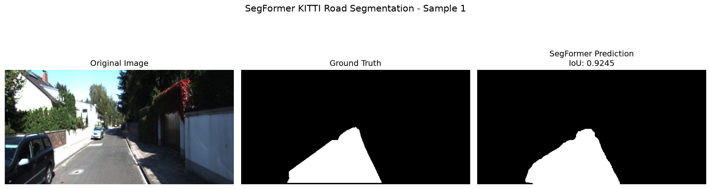
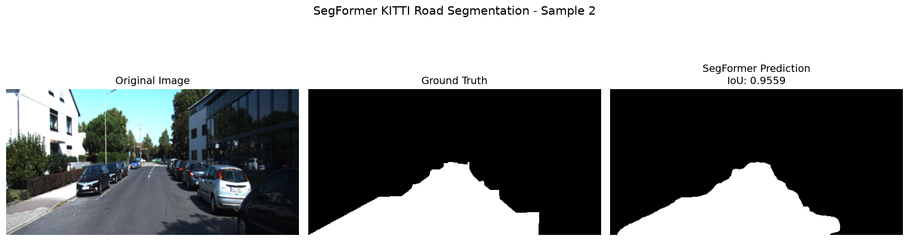
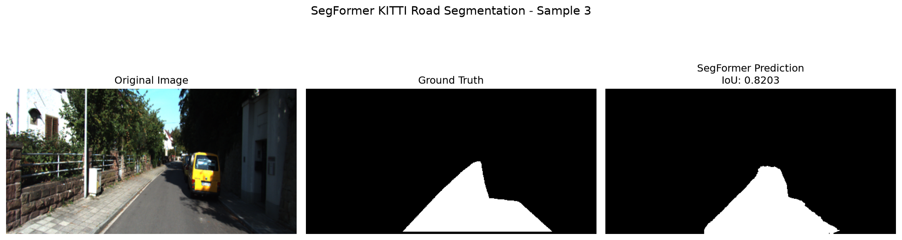
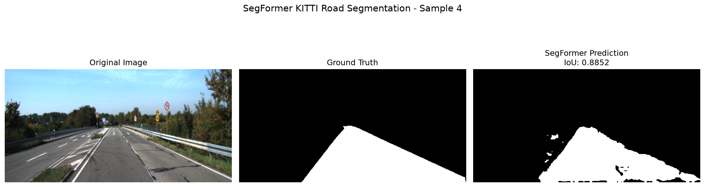
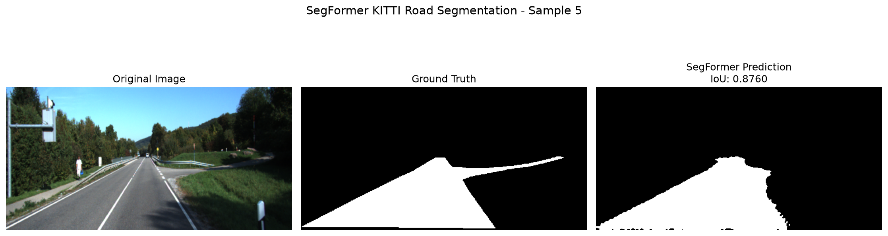
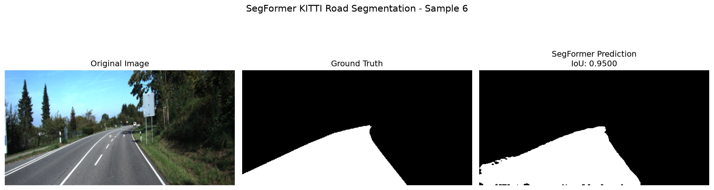
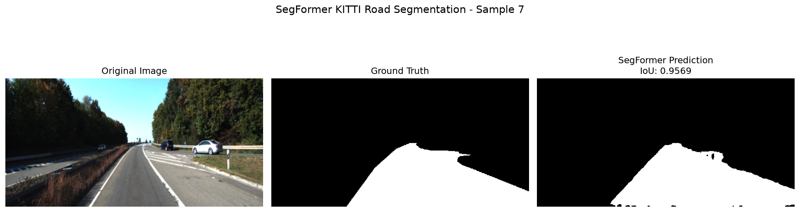
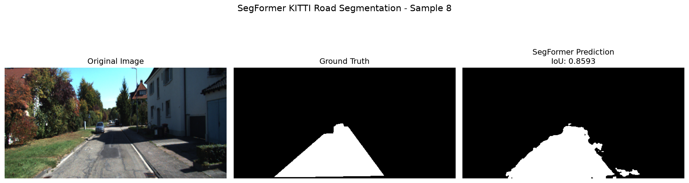
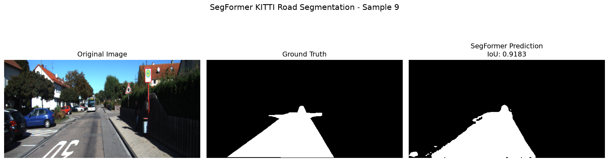
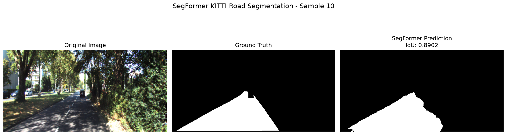

# KITTI Road Segmentation with SegFormer

A semantic road segmentation project using **transfer learning and fine-tuning with SegFormer-B0** on the KITTI Road dataset.

The project starts with a SegFormer model pretrained on ADE20K and adapts it for binary road segmentation on KITTI.

---

## Table of Contents

- [Overview](#overview)
- [Objectives](#objectives)
- [Dataset](#dataset)
- [Dataset Preparation](#dataset-preparation)
- [Mask Processing](#mask-processing)
- [Model](#model)
- [Model Adaptation](#model-adaptation)
- [Loss Function](#loss-function)
- [Training Strategy](#training-strategy)
- [Experiment 1 — Frozen Backbone](#experiment-1--frozen-backbone)
- [Experiment 2 — Stage 3 Fine-Tuning](#experiment-2--stage-3-fine-tuning)
- [Experiment 3 — Stage 2 + Stage 3 Fine-Tuning](#experiment-3--stage-2--stage-3-fine-tuning)
- [Final Results](#final-results)
- [Evaluation Metrics](#evaluation-metrics)
- [Qualitative Results](#qualitative-results)
- [Technologies Used](#technologies-used)
- [Project Structure](#project-structure)
- [How to Run](#how-to-run)
- [Key Concepts Demonstrated](#key-concepts-demonstrated)
- [Conclusion](#conclusion)

---

# Overview

The objective of this project is to perform **binary semantic segmentation of roads** in KITTI road images.

For every pixel in an input image, the model predicts whether that pixel belongs to:

- **Background**
- **Road**

Instead of training a segmentation model from scratch, a pretrained **SegFormer-B0** model was used as the starting point.

The model was progressively fine-tuned to investigate how adapting the pretrained backbone affects performance on the KITTI road segmentation task.

The final selected model achieved:

- **Validation IoU: 90.27%**
- **Validation Dice: 94.89%**

---

# Objectives

The main objectives of the project were:

1. Prepare the KITTI Road dataset for semantic segmentation.
2. Convert the original KITTI masks into binary road masks.
3. Load a pretrained SegFormer model.
4. Adapt the pretrained model from 150 classes to 2 classes.
5. Establish a frozen-backbone baseline.
6. Fine-tune deeper parts of the SegFormer backbone.
7. Compare different fine-tuning strategies.
8. Evaluate the final model using IoU and Dice score.
9. Generate visualizations of predictions on validation images.

---

# Dataset

The project uses the **KITTI Road Dataset**.

The dataset contains:

```text
Total labeled images: 289
Training images:      231
Validation images:     58
```

An **80/20 train-validation split** was used.

A fixed random seed of `42` was used so that the same images are assigned to the training and validation sets across experiments.

```text
Training:   80% → 231 images
Validation: 20% → 58 images
```

---

# Dataset Preparation

A custom PyTorch dataset was created in `dataset.py`:

```python
from dataset import KITTIRoadDataset

dataset = KITTIRoadDataset(
    root="../road_segmentation/data/data_road/training"
)
```

The images are resized to:

```text
256 × 512
```

The resulting image tensor has the shape:

```text
[3, 256, 512]
```

where:

```text
3   → RGB channels
256 → Height
512 → Width
```

The corresponding segmentation mask has the shape:

```text
[1, 256, 512]
```

---

# Mask Processing

The original KITTI road segmentation masks contain multiple pixel colors.

For the dataset used in this project, the observed colors were:

```text
[0, 0, 0]       → Background
[255, 0, 0]     → Background
[255, 0, 255]   → Road
```

The road region was extracted using the magenta pixel value:

```python
mask = (
    (mask[0] == 255) &
    (mask[1] == 0) &
    (mask[2] == 255)
).float().unsqueeze(0)
```

The resulting masks contain only two values:

```text
0 → Background
1 → Road
```

A dataset verification produced:

```text
Samples: 289
Image: torch.Size([3, 256, 512])
Mask: torch.Size([1, 256, 512])
Mask values: tensor([0., 1.])
```

---

# Model

The pretrained model used in this project is:

```text
nvidia/segformer-b0-finetuned-ade-512-512
```

This is a **SegFormer-B0** semantic segmentation model pretrained on the ADE20K dataset.

The original model predicts:

```text
150 classes
```

For this project, the model was adapted to predict only:

```text
Class 0 → Background
Class 1 → Road
```

---

# Model Adaptation

The original SegFormer classifier was replaced with a new two-class classifier:

```python
model.decode_head.classifier = nn.Conv2d(
    256,
    2,
    kernel_size=1
)

model.config.num_labels = 2
```

The model therefore produces two logits for every pixel:

```text
Background
Road
```

The predicted class is obtained using:

```python
prediction = torch.argmax(logits, dim=1)
```

The model output is resized to the ground-truth mask resolution before evaluation.

---

# Loss Function

Since this is a two-class semantic segmentation problem, **CrossEntropyLoss** was used:

```python
criterion = nn.CrossEntropyLoss()
```

The binary masks produced by the dataset are converted to the required class-index format during training:

```python
masks = masks.squeeze(1).long()
```

---

# Training Strategy

Three training experiments were performed.

The purpose was to progressively adapt more of the pretrained SegFormer model to the KITTI dataset.

### Experiments

```text
Experiment 1
Frozen Backbone
        ↓
87.41% IoU

Experiment 2
Fine-tune Stage 3
        ↓
87.60% IoU

Experiment 3
Fine-tune Stage 2 + Stage 3
        ↓
90.27% IoU
```

---

# Experiment 1 — Frozen Backbone

In the first experiment, the entire SegFormer backbone was frozen.

Only the newly initialized decode head was trained.

```text
Stage 0       → Frozen
Stage 1       → Frozen
Stage 2       → Frozen
Stage 3       → Frozen
Decode Head   → Trainable
```

### Training Configuration

```text
Optimizer:     Adam
Loss:          CrossEntropyLoss
Batch size:    4
Epochs:        10
Learning rate: 0.001
```

Only the decode-head parameters were passed to the optimizer.

### Result

```text
Validation IoU: 87.41%
```

Checkpoint:

```text
segformer_kitti_frozen.pth
```

This experiment provided the baseline performance using the pretrained SegFormer representation without fine-tuning the backbone.

---

# Experiment 2 — Stage 3 Fine-Tuning

The second experiment allowed the final SegFormer stage to adapt to the KITTI dataset.

```text
Stage 0       → Frozen
Stage 1       → Frozen
Stage 2       → Frozen
Stage 3       → Trainable
Decode Head   → Trainable
```

A smaller learning rate was used for the pretrained Stage 3 parameters.

### Learning Rates

```text
Stage 3:      1e-5
Decode Head:  1e-3
```

### Training Configuration

```text
Optimizer:    Adam
Loss:         CrossEntropyLoss
Batch size:   4
Epochs:       10
```

### Result

```text
Validation IoU: 87.60%
```

Checkpoint:

```text
segformer_kitti_finetuned.pth
```

---

# Experiment 3 — Stage 2 + Stage 3 Fine-Tuning

The final experiment allowed both Stage 2 and Stage 3 of the SegFormer backbone to adapt to the KITTI dataset.

```text
Stage 0       → Frozen
Stage 1       → Frozen
Stage 2       → Trainable
Stage 3       → Trainable
Decode Head   → Trainable
```

Different learning rates were used for the different parts of the network.

### Learning Rates

```text
Stage 2:      5e-6
Stage 3:      1e-5
Decode Head:  5e-4
```

### Training Configuration

```text
Optimizer:    Adam
Loss:         CrossEntropyLoss
Batch size:   4
Epochs:       20
```

The model was evaluated on the validation set after every epoch.

The checkpoint with the highest validation IoU was saved:

```python
if val_iou > best_iou:
    best_iou = val_iou
    torch.save(
        model.state_dict(),
        "segformer_kitti_best.pth"
    )
```

---

# Final Results

The three experiments produced the following validation IoU values:

| Experiment | Trainable Backbone | Epochs | Validation IoU |
|---|---|---:|---:|
| Frozen baseline | None | 10 | **87.41%** |
| Stage 3 fine-tuning | Stage 3 | 10 | **87.60%** |
| Stage 2 + Stage 3 fine-tuning | Stage 2 + Stage 3 | 20 | **90.27%** |

The best result occurred at **epoch 19** of the final experiment.

```text
Best Epoch:       19
Validation IoU:   90.27%
Validation Dice:  94.89%
```

At epoch 20, the validation IoU was:

```text
89.59%
```

Therefore, the epoch-19 checkpoint was retained as the best model.

### Final Selected Checkpoint

```text
segformer_kitti_best.pth
```

### Final Performance

```text
IoU:  90.27%
Dice: 94.89%
```

---

# Evaluation Metrics

## Intersection over Union (IoU)

IoU measures the overlap between the predicted road region and the ground-truth road region.

```text
IoU = Intersection / Union
```

where:

```text
Intersection = Prediction ∩ Ground Truth

Union = Prediction ∪ Ground Truth
```

The final model achieved:

```text
IoU = 0.9027
```

or:

```text
90.27%
```

---

## Dice Score

Dice measures the overlap between the prediction and ground truth:

```text
Dice =
2 × Intersection
----------------------------
Prediction + Ground Truth
```

The final model achieved:

```text
Dice = 0.9489
```

or:

```text
94.89%
```

---

# Qualitative Results

Ten randomly selected images from the validation set were used for qualitative evaluation.

Each result contains:

1. Original KITTI image
2. Ground-truth road mask
3. SegFormer prediction
4. Per-image IoU

The images were selected using a fixed random seed of `42`.

All result images are stored inside:

```text
results/
```

---

## Sample 01

**Path:** `results/sample_01.png`



---

## Sample 02

**Path:** `results/sample_02.png`



---

## Sample 03

**Path:** `results/sample_03.png`



---

## Sample 04

**Path:** `results/sample_04.png`



---

## Sample 05

**Path:** `results/sample_05.png`



---

## Sample 06

**Path:** `results/sample_06.png`



---

## Sample 07

**Path:** `results/sample_07.png`



---

## Sample 08

**Path:** `results/sample_08.png`



---

## Sample 09

**Path:** `results/sample_09.png`



---

## Sample 10

**Path:** `results/sample_10.png`



---

# Result File Paths

All ten visualization files are located in the `results/` directory:

| Sample | Result Path |
|---|---|
| Sample 01 | `results/sample_01.png` |
| Sample 02 | `results/sample_02.png` |
| Sample 03 | `results/sample_03.png` |
| Sample 04 | `results/sample_04.png` |
| Sample 05 | `results/sample_05.png` |
| Sample 06 | `results/sample_06.png` |
| Sample 07 | `results/sample_07.png` |
| Sample 08 | `results/sample_08.png` |
| Sample 09 | `results/sample_09.png` |
| Sample 10 | `results/sample_10.png` |

---

# Hardware

Training was performed using:

```text
GPU:  NVIDIA RTX 3050 Laptop GPU
VRAM: 6 GB
```

CUDA-enabled PyTorch was used for training and inference.

---

# Technologies Used

- Python
- PyTorch
- Hugging Face Transformers
- SegFormer
- CUDA
- NumPy
- Matplotlib
- KITTI Road Dataset
- Git
- GitHub

---

# Project Structure

```text
kitti_segformer/
│
├── dataset.py
├── train.py
├── evaluate.py
├── visualise.py
├── README.md
├── .gitignore
│
├── results/
│   ├── sample_01.png
│   ├── sample_02.png
│   ├── sample_03.png
│   ├── sample_04.png
│   ├── sample_05.png
│   ├── sample_06.png
│   ├── sample_07.png
│   ├── sample_08.png
│   ├── sample_09.png
│   └── sample_10.png
│
├── segformer_kitti_frozen.pth
├── segformer_kitti_finetuned.pth
└── segformer_kitti_best.pth
```

The `.pth` checkpoint files are excluded from GitHub using `.gitignore`.

The `results/` directory is **not** excluded, so the result images can be displayed directly in the GitHub README.

---

# How to Run

## 1. Install Dependencies

Create or activate the Python environment and install the required packages:

```bash
pip install torch torchvision
pip install transformers accelerate
pip install numpy matplotlib
```

---

## 2. Prepare the Dataset

The KITTI Road dataset should be available at:

```text
../road_segmentation/data/data_road/training
```

The dataset should contain the KITTI training images and their corresponding ground-truth masks.

---

## 3. Train the Model

Run:

```bash
python train.py
```

The training script:

1. Loads the KITTI dataset.
2. Creates the fixed 80/20 train-validation split.
3. Loads the pretrained SegFormer-B0.
4. Replaces the 150-class classifier with a 2-class classifier.
5. Fine-tunes the selected backbone stages.
6. Calculates validation IoU after each epoch.
7. Saves the best-performing checkpoint.

---

## 4. Evaluate the Model

Run:

```bash
python evaluate.py
```

The evaluation script loads:

```text
segformer_kitti_best.pth
```

and calculates:

```text
IoU
Dice Score
```

---

## 5. Generate Visualizations

Run:

```bash
python visualise.py
```

This generates ten validation visualizations in:

```text
results/
```

The generated images contain:

```text
Original Image
Ground Truth
SegFormer Prediction
Per-image IoU
```

---

# Transfer Learning Approach

The project demonstrates a progressive transfer-learning strategy.

Instead of immediately fine-tuning the entire pretrained network, increasingly deeper portions of the network were allowed to adapt to the new dataset.

```text
Pretrained SegFormer
        │
        ▼
Replace 150-class classifier
        │
        ▼
Binary KITTI segmentation
        │
        ├─────────────────────┐
        │                     │
        ▼                     ▼
Frozen Backbone       Stage 3 Fine-Tuning
   87.41%                  87.60%
        │
        └──────────────┐
                       ▼
             Stage 2 + Stage 3
                Fine-Tuning
                       │
                       ▼
                    90.27%
```

---

# Key Concepts Demonstrated

This project demonstrates several important concepts in modern computer vision and deep learning.

### Semantic Segmentation

Predicting a semantic class for every pixel in an image.

### Transfer Learning

Starting from a model pretrained on a large external dataset rather than training the complete model from scratch.

### Fine-Tuning

Allowing selected pretrained layers to update their parameters for the target dataset.

### SegFormer

A Transformer-based architecture designed for semantic segmentation.

### Binary Segmentation

Reducing the segmentation problem to two classes:

```text
Background
Road
```

### Layer Freezing

Preventing selected pretrained layers from being updated during training.

### Layer-Wise Learning Rates

Using different learning rates for different portions of the model.

### Cross-Entropy Loss

The loss function used for the two-class segmentation task.

### IoU

A metric measuring the overlap between prediction and ground truth.

### Dice Score

Another overlap-based segmentation metric.

### Validation-Based Checkpointing

Saving the model corresponding to the highest validation IoU rather than automatically using the final training epoch.

---

# Conclusion

This project adapted a pretrained **SegFormer-B0** model for binary road segmentation on the KITTI Road dataset.

The training process progressed from a completely frozen pretrained backbone to fine-tuning deeper portions of the model.

The measured validation results were:

```text
Frozen Backbone
       ↓
87.41% IoU

Stage 3 Fine-Tuning
       ↓
87.60% IoU

Stage 2 + Stage 3 Fine-Tuning
       ↓
90.27% IoU
```

The final selected checkpoint achieved:

```text
Validation IoU:   90.27%
Validation Dice:  94.89%
```

using **289 labeled images**, with **231 images for training** and **58 images for validation**.

The project demonstrates a complete transfer-learning workflow covering:

```text
Dataset Preparation
        ↓
Mask Processing
        ↓
Pretrained Model
        ↓
Model Adaptation
        ↓
Frozen Baseline
        ↓
Selective Fine-Tuning
        ↓
Validation
        ↓
Best Checkpoint Selection
        ↓
Quantitative Evaluation
        ↓
Qualitative Visualization
```

The resulting model and visualization pipeline provide a complete example of applying a pretrained Transformer-based segmentation model to a new road-segmentation dataset.
